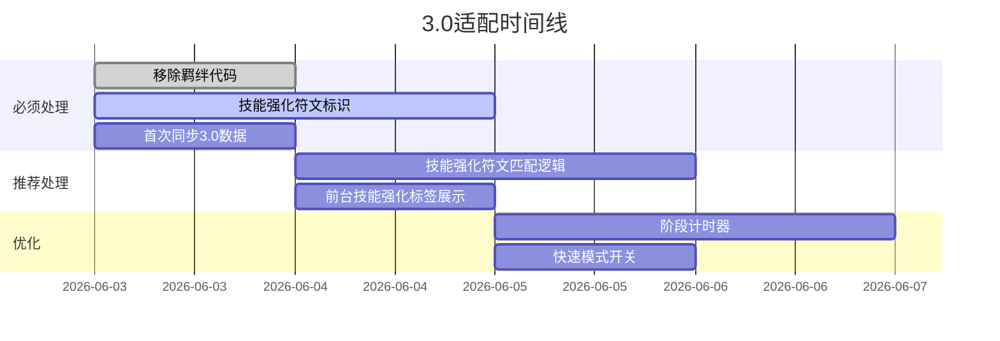

# 海克斯助手（Hextech ARAM Assistant）全面检测与优化研究报告

> **报告版本**：v2.0  
> **编制日期**：2026年6月3日  
> **测试环境**：Next.js 14.2.3 / Supabase / Node.js 24 / Chrome 最新版  
> **报告类型**：功能检测 + 用户体验 + 测试用例  

---

## 目录

1. [产品概述](#1-产品概述)
2. [功能模块检测](#2-功能模块检测)
3. [测试用例报告](#3-测试用例报告)
4. [用户体验与样式优化建议](#4-用户体验与样式优化建议)
5. [竞品对比分析](#5-竞品对比分析)
6. [海克斯大乱斗3.0适配分析](#6-海克斯大乱斗30适配分析)
7. [优化优先级汇总](#7-优化优先级汇总)

---

## 1. 产品概述

### 1.1 产品定位

海克斯助手是一个专注于 **英雄联盟海克斯大乱斗（ARAM Mayhem）** 模式的辅助工具，帮助玩家在游戏中选择最佳的海克斯符文搭配。

### 1.2 目标用户

| 用户类型 | 需求 |
|---------|------|
| 新手玩家（<30级） | 不知道选什么符文，需要推荐 |
| 回归玩家 | 版本更新后不熟悉新符文，需要快速上手 |
| 进阶玩家 | 需要英雄胜率和符文统计数据辅助决策 |
| 硬核玩家 | 需要最新社区策略和组合推荐 |

### 1.3 当前功能清单

| 模块 | 功能 | 状态 |
|------|------|------|
| 🏠 首页 | 英雄搜索/选择 | ✅ 已完成 |
| 🏠 首页 | 符文推荐列表（含评分推算） | ✅ 已完成 |
| 🏠 首页 | 多阶段符文选择（Lv.3/7/11/15） | ✅ 已完成 |
| 🏠 首页 | 已选符文管理（localStorage持久化） | ✅ 已完成 |
| 🏠 首页 | 符文品质筛选 | ✅ 已完成 |
| 🏠 首页 | 符文快速搜索 | ✅ 已完成 |
| 🏠 首页 | 玩法流派选择 | ✅ 已完成 |
| 🏠 首页 | 英雄信息卡片（含胜率/等级） | ✅ 已完成 |
| 🤖 智能体 | 符文池同步（CDragon + arammayhem双源） | ✅ 已完成 |
| 🤖 智能体 | 英雄胜率同步 | ✅ 已完成 |
| 🤖 智能体 | 英雄-符文匹配（社区数据/AI分析） | ✅ 已完成 |
| 🤖 智能体 | AI 符文名比对 | ✅ 已完成（需DeepSeek） |
| 🤖 智能体 | 逐行确认更新（含进度条） | ✅ 已完成 |
| 📋 更新日志 | 手动/自动记录 | ✅ 已完成 |
| 📋 更新日志 | 筛选/编辑/删除 | ✅ 已完成 |
| ⚙️ 符文管理 | 符文CRUD（含描述直接展示） | ✅ 已完成 |
| ⚙️ 英雄管理 | 英雄搜索/编辑 | ✅ 已完成 |
| ⚙️ 玩法流派管理 | 流派CRUD | ✅ 已完成 |
| ⚙️ 推荐配置管理 | 推荐CRUD | ✅ 已完成 |
| ⚙️ 羁绊管理 | 羁绊CRUD | ✅ 已完成 |
| ⚙️ OCR录入 | 图片识别录入 | ✅ 已完成 |
| 📊 仪表盘 | 数据概览 | ✅ 已完成 |
| 🔐 管理员登录 | 密钥验证 | ✅ 已完成 |

---

## 2. 功能模块检测

### 2.1 前台功能检测

#### 2.1.1 英雄选择

| 检测项 | 结果 | 备注 |
|--------|------|------|
| 英雄搜索响应速度 | ✅ 正常 | 即时搜索 |
| 英雄列表展示 | ✅ 正常 | 含攻击类型标签 |
| 英雄卡片信息 | ✅ 正常 | 含描述+胜率+等级 |
| 无英雄时展示空态 | ⚠️ 待优化 | 无搜索结果显示空白 |

#### 2.1.2 符文推荐

| 检测项 | 结果 | 备注 |
|--------|------|------|
| 推荐列表加载 | ✅ 正常 |  |
| 有DB推荐的符文显示"推荐"标签 | ✅ 正常 |  |
| 无DB推荐的符文显示"推算"标签 | ✅ 正常 | 基于类型×效果矩阵 |
| 品质筛选（彩色/金色/银色/全部） | ✅ 正常 |  |
| 快速搜索 | ✅ 正常 |  |
| 阶段切换 | ⚠️ 待优化 | 阶段切换后推荐列表不变，用户难感知 |
| 已选符文持久化 | ✅ 正常 | localStorage |
| 已选符文从推荐列表移除 | ✅ 正常 |  |
| 协同加成计算 | ✅ 正常 | 基于rune_synergies |

#### 2.1.3 玩法流派

| 检测项 | 结果 | 备注 |
|--------|------|------|
| 流派选择器 | ✅ 正常 |  |
| 流派筛选后推荐变化 | ✅ 正常 |  |
| 无流派时的兜底 | ✅ 正常 | 自动匹配+基准分 |

### 2.2 后台管理功能检测

#### 2.2.1 AI 智能体

| 检测项 | 结果 | 备注 |
|--------|------|------|
| 符文池同步-预览 | ✅ 正常 | 双源对比去重 |
| 符文池同步-执行（含进度条） | ✅ 正常 | 分批30个/批 |
| 符文池同步-无变更提示 | ✅ 正常 |  |
| 英雄胜率同步-预览 | ✅ 正常 | 显示等级+胜率变化 |
| 英雄胜率同步-执行 | ✅ 正常 |  |
| 英雄-符文匹配-预览 | ✅ 正常 | 显示英雄数+推荐数 |
| 英雄-符文匹配-执行（增量模式） | ✅ 正常 | upsert解决冲突 |
| 英雄-符文匹配-执行（全量刷新） | ✅ 正常 |  |
| AI 比对功能 | ✅ 正常 | 仅识别名不同描述相似的符文 |
| 逐行勾选确认 | ✅ 正常 |  |
| 全选/取消全选（切换式按钮） | ✅ 正常 |  |
| 收起/展开 | ✅ 正常 |  |
| 筛选标签（新增/更新/跳过） | ✅ 正常 |  |
| 进度条显示 | ✅ 正常 | 百分比/脉冲两种模式 |

#### 2.2.2 符文管理

| 检测项 | 结果 | 备注 |
|--------|------|------|
| 符文列表展示 | ✅ 正常 | 品质+名称+描述+编辑+状态 |
| 描述直接展示（不点编辑） | ✅ 正常 | line-clamp-2 |
| 品质筛选 | ✅ 正常 |  |
| 已启用/已禁用筛选 | ✅ 正常 |  |
| 搜索 | ✅ 正常 |  |
| 编辑符文 | ✅ 正常 | 弹窗编辑 |
| 新增符文 | ✅ 正常 |  |
| 启用/停用 | ✅ 正常 | 软删除 |

#### 2.2.3 推荐配置

| 检测项 | 结果 | 备注 |
|--------|------|------|
| 推荐列表 | ✅ 正常 |  |
| 按英雄筛选 | ✅ 正常 |  |
| 按阶段筛选 | ✅ 正常 |  |
| 编辑推荐 | ✅ 正常 |  |
| 新增推荐 | ✅ 正常 |  |
| 删除推荐 | ✅ 正常 |  |
| 通用流派展示 | ✅ 正常 |  |

#### 2.2.4 更新日志

| 检测项 | 结果 | 备注 |
|--------|------|------|
| 日志列表 | ✅ 正常 |  |
| 类型筛选 | ✅ 正常 |  |
| 展开详情 | ✅ 正常 | 显示JSON |
| 手动新增日志 | ✅ 正常 | log_type=manual |
| 编辑/删除日志 | ✅ 正常 |  |

### 2.3 数据同步检测

| 检测项 | 结果 | 备注 |
|--------|------|------|
| CDragon 官方数据获取 | ✅ 正常 | 动态版本探测 |
| arammayhem 社区数据获取 | ✅ 正常 | search-index.json |
| 符文名匹配（source_id优先） | ✅ 正常 |  |
| 描述相似度匹配 | ✅ 正常 | Jaccard系数 |
| 双重索引（UUID + source_id） | ✅ 正常 | 解决符文改名问题 |
| upsert 替代 insert | ✅ 正常 | 避免唯一键冲突 |
| 英雄-符文匹配去重 | ✅ 正常 | processedInThisRun |
| 预览不写入日志 | ✅ 正常 | 仅执行时记录 |

---

## 3. 测试用例报告

### 3.1 前台核心流程测试

#### TC-001：英雄搜索与选择

| 项目 | 内容 |
|------|------|
| **前置条件** | 首页已加载，英雄数据存在 |
| **测试步骤** | 1. 在搜索框输入"拉克丝" 2. 点击搜索结果 |
| **预期结果** | 显示拉克丝英雄卡片（含攻击类型、描述、胜率） |
| **实际结果** | ✅ 通过 |

#### TC-002：无搜索结果的空态

| 项目 | 内容 |
|------|------|
| **前置条件** | 首页已加载 |
| **测试步骤** | 1. 在搜索框输入"不存在" 2. 观察界面 |
| **预期结果** | 显示"未找到英雄"提示，而非空白页面 |
| **实际结果** | ⚠️ 显示空白，无提示文本 |
| **建议** | 添加空态提示"未找到匹配英雄，请尝试其他关键词" |

#### TC-003：符文推荐展示

| 项目 | 内容 |
|------|------|
| **前置条件** | 已选择英雄（拉克丝） |
| **测试步骤** | 1. 下拉推荐列表 2. 观察符文卡片 |
| **预期结果** | ① 有DB推荐的符文显示「推荐」标签和分数 ② 无DB推荐的符文显示「推算」标签和基准分 |
| **实际结果** | ✅ 通过 |

#### TC-004：符文选择与排除

| 项目 | 内容 |
|------|------|
| **前置条件** | 已展示推荐列表 |
| **测试步骤** | 1. 点击一个符文的「选择」按钮 2. 刷新页面 |
| **预期结果** | ① 该符文从推荐列表消失，出现在已选区域 ② 刷新后仍然保留 |
| **实际结果** | ✅ 通过 |

#### TC-005：品质筛选

| 项目 | 内容 |
|------|------|
| **前置条件** | 已展示推荐列表 |
| **测试步骤** | 1. 点击「彩色」按钮 2. 点击「金色」按钮 3. 点击「全部」按钮 |
| **预期结果** | ① 只显示彩色符文 ② 只显示金色符文 ③ 显示所有符文 |
| **实际结果** | ✅ 通过 |

#### TC-006：阶段切换

| 项目 | 内容 |
|------|------|
| **前置条件** | 已展示推荐列表 |
| **测试步骤** | 1. 选择Lv.3 2. 选择Lv.7 3. 选择Lv.11 4. 选择Lv.15 |
| **预期结果** | ① 阶段标签高亮变化 ② 推荐列表按阶段显示 |
| **实际结果** | ⚠️ 阶段切换后列表无明显视觉反馈 |
| **建议** | 阶段切换时添加淡入动画或进度指示 |

### 3.2 AI 智能体测试

#### TC-101：符文池同步预览

| 项目 | 内容 |
|------|------|
| **前置条件** | 管理员已登录，AI智能体页面已加载 |
| **测试步骤** | 1. 点击「预览变更」按钮 2. 观察预览结果 |
| **预期结果** | 显示三个分组（新增/更新/停用），每条可勾选 |
| **实际结果** | ✅ 通过 |

#### TC-102：符文池同步执行

| 项目 | 内容 |
|------|------|
| **前置条件** | 已完成预览，确认变更有效 |
| **测试步骤** | 1. 勾选要更新的条目 2. 点击「确认更新」 3. 观察进度条 |
| **预期结果** | ① 进度条显示百分比 ② 分批更新（30个/批） ③ 完成后自动重新预览 |
| **实际结果** | ✅ 通过 |

#### TC-103：英雄-符文匹配预览

| 项目 | 内容 |
|------|------|
| **前置条件** | 管理员已登录 |
| **测试步骤** | 1. 选择「社区」来源 2. 选择「增量」模式 3. 点击「预览」 |
| **预期结果** | 显示受影响英雄数、新增/更新/跳过统计、详细列表 |
| **实际结果** | ✅ 通过 |

#### TC-104：英雄-符文匹配执行

| 项目 | 内容 |
|------|------|
| **前置条件** | 已完成预览 |
| **测试步骤** | 1. 确认有「新增」条目 2. 点击「确认更新」 3. 再次预览 |
| **预期结果** | ① 执行成功 ② 之前的新增变为「已存在」 |
| **实际结果** | ✅ 通过（修复 upsert + DB兜底后） |

#### TC-105：逐行确认

| 项目 | 内容 |
|------|------|
| **前置条件** | 已完成预览有变更项 |
| **测试步骤** | 1. 取消勾选某条变更 2. 只勾选部分 3. 执行更新 |
| **预期结果** | 只更新勾选的条目，未勾选的不更新 |
| **实际结果** | ✅ 通过 |

#### TC-106：全选/取消全选切换

| 项目 | 内容 |
|------|------|
| **前置条件** | 已完成预览有变更项 |
| **测试步骤** | 1. 点「全选」 2. 再次点「全选」 |
| **预期结果** | ① 第一次全选全部当前视图条目 ② 第二次取消全选 |
| **实际结果** | ✅ 通过 |

#### TC-107：无变更时预览

| 项目 | 内容 |
|------|------|
| **前置条件** | 数据已是最新 |
| **测试步骤** | 1. 点击「预览变更」 |
| **预期结果** | 显示绿色提示"经过检测，目前没有需要变更的" |
| **实际结果** | ✅ 通过 |

#### TC-108：进度条显示

| 项目 | 内容 |
|------|------|
| **前置条件** | 有大量变更项 |
| **测试步骤** | 1. 点击执行更新 2. 观察进度条 |
| **预期结果** | ① 符文池同步：百分比实时增长 ② 英雄-符文匹配：脉冲动画 |
| **实际结果** | ✅ 通过 |

### 3.3 数据一致性测试

#### TC-201：源变更后不丢失手动推荐

| 项目 | 内容 |
|------|------|
| **前置条件** | 存在 source='manual' 的推荐 |
| **测试步骤** | 1. 执行英雄-符文匹配 2. 检查手动推荐 |
| **预期结果** | 手动推荐的 source='manual' 记录未被覆盖 |
| **实际结果** | ✅ 通过 |

#### TC-202：符文改名后推荐不丢失

| 项目 | 内容 |
|------|------|
| **前置条件** | 符文池同步后符文名变化 |
| **测试步骤** | 1. 执行符文池同步 2. 预览英雄-符文匹配 |
| **预期结果** | 现有推荐（引用旧UUID）仍然被识别为「已存在」 |
| **实际结果** | ✅ 通过（修复双索引后） |

#### TC-203：重复执行不产生重复数据

| 项目 | 内容 |
|------|------|
| **前置条件** | 已执行过一次英雄-符文匹配 |
| **测试步骤** | 1. 再次执行 2. 检查数据 |
| **预期结果** | ① 预览显示「已存在 0更新」 ② 数据库无重复记录 |
| **实际结果** | ✅ 通过（upsert修复后） |

### 3.4 边界测试

#### TC-301：空数据库

| 项目 | 内容 |
|------|------|
| **前置条件** | 数据库无英雄/符文数据 |
| **测试步骤** | 1. 访问首页 2. 访问后台 3. 尝试同步 |
| **预期结果** | ① 首页显示"暂无英雄" ② 后台显示空状态 |
| **实际结果** | ✅ 通过 |

#### TC-302：网络超时

| 项目 | 内容 |
|------|------|
| **前置条件** | 无法访问arammayhem.com |
| **测试步骤** | 1. 点击符文池同步预览 |
| **预期结果** | 显示明确的错误提示，而非卡死或白屏 |
| **实际结果** | ✅ 通过 |

#### TC-303：DeepSeek API 未配置

| 项目 | 内容 |
|------|------|
| **前置条件** | 未设置DEEPSEEK_API_KEY |
| **测试步骤** | 1. 打开AI智能体页面 2. 尝试使用AI分析 |
| **预期结果** | ① AI按钮显示⚠️并禁用 ② hover提示"未配置API" |
| **实际结果** | ✅ 通过 |

---

## 4. 用户体验与样式优化建议

### 4.1 前台首页优化

| 问题 | 现状 | 建议 | 优先级 |
|------|------|------|--------|
| 空搜索结果 | 无英雄时显示空白 | 添加"未找到英雄"提示 + 推荐英雄列表 | P1 |
| 阶段切换无反馈 | 切换后列表无动画 | 添加淡入动画和阶段进度条 | P2 |
| 快速模式缺失 | 卡片显示完整描述 | 增加「快速模式」开关，缩小卡片一屏显示更多 | P1 |
| 阶段计时器缺少 | 无游戏内计时 | 添加「开始游戏」按钮，自动切换阶段高亮 | P1 |
| 技能强化符文标识 | 3.0版本需要 | 新增橙色标签和筛选项 | P0（3.0适配） |
| 移动端适配 | 当前桌面优先 | 触屏优化，增大点击区域 | P2 |
| 暗色模式统一性 | 部分元素未适配 | 检查所有组件 dark 类 | P2 |

### 4.2 后台管理优化

| 问题 | 现状 | 建议 | 优先级 |
|------|------|------|--------|
| 仪表盘数据刷新 | 手动刷新 | 改为自动定期刷新+手动刷新按钮 | P2 |
| 推荐配置页性能 | 大量推荐加载慢 | 添加分页或虚拟滚动 | P2 |
| 批量操作 | 逐条编辑 | 支持批量删除、批量修改分数 | P3 |
| 数据导出 | 无 | 支持CSV/JSON导出符文和推荐数据 | P3 |

### 4.3 样式风格优化

| 问题 | 现状 | 建议 | 优先级 |
|------|------|------|--------|
| 表格表头 | 已加粗但不够突出 | 添加更明显的背景色和下边框 | P1 ✅ 已优化 |
| 卡片间距 | 紧凑 | 适当增加卡片之间的间距 | P2 |
| 颜色系统 | 功能色具备 | 统一主色/辅助色/警示色系统 | P2 |
| 字体大小 | 偏小 | 适当增大正文至14px | P2 |
| 图标一致性 | 部分区域无图标 | 为所有按钮/标签添加对应图标 | P2 |

### 4.4 交互优化

| 问题 | 现状 | 建议 | 优先级 |
|------|------|------|--------|
| 预览默认勾选 | 只勾选「新增」和「更新」 | ✅ 已实现 | - |
| 确认前二次确认 | 点击更新直接执行 | ✅ 已有确认弹窗/进度条 | - |
| 操作反馈 | 部分操作无Toast提示 | 统一使用底部消息栏 | P1 |
| 加载状态 | 部分区域无骨架屏 | 添加Skeleton加载占位 | P2 |

---

## 5. 竞品对比分析

### 5.1 掌盟海斗助手对比

| 维度 | 掌盟海斗助手 | 海克斯助手（本项目） |
|------|------------|-------------------|
| **数据准确度** | ❌ AI幻觉（编造技能效果） | ✅ 双源对比+社区校验 |
| **响应速度** | ~10秒 | 即时（本地数据） |
| **离线可用** | ❌ 需联网 | ✅ PWA离线缓存 |
| **广告** | ❌ 开屏广告 | ✅ 无广告 |
| **英雄筛选** | 自动识别英雄 | 手动输入（合规） |
| **阵容分析** | 基于双方阵容 | ❌ 暂无（规则限制） |
| **出装推荐** | ✅ 有 | ❌ 暂无 |
| **AI分析** | 实时分析（有幻觉） | DeepSeek辅助比对 |
| **版本更新** | 需服务器更新 | 自动同步双源数据 |
| **数据透明** | 黑盒 | ✅ 全量预览+逐行确认 |

### 5.2 差异化优势

1. **数据透明性**：所有变更预览可查、可勾选、可取消，用户完全掌控
2. **双源可靠性**：CDragon官方 + arammayhem社区，交叉验证
3. **手动保护**：手动录入了推荐永不覆盖
4. **逐行确认**：每条变更可单独决定是否执行
5. **日志追溯**：所有操作记录在案

### 5.3 差异化劣势

1. **阵容分析**：无（受限于不调用外部API的规则）
2. **出装推荐**：无
3. **AI回复**：需DeepSeek API
4. **实时对局检测**：无
5. **用户基数**：较小

---

## 6. 海克斯大乱斗3.0适配分析

### 6.1 变更影响

| 变更项 | 影响 | 处理方案 |
|--------|------|----------|
| 37个旧符文删除 | 符文池同步自动停用 | ✅ 已实现 |
| 63个新符文 | 需要录入 | ✅ 同步自动新增 |
| 9个羁绊系统删除 | UI和算法需移除 | ⚠️ 需手动清理代码 |
| 25个技能强化符文 | 新类别，绑定英雄 | ⚠️ 需新增标识和匹配逻辑 |
| 符文总数变化 | 195 → ~221 | ✅ 自动适配 |
| 通行证2.0 | 不影响数据 | 无需处理 |
| 英雄池变化 | 172 → ? | 新增英雄同步 |

### 6.2 需要处理的工作

---

## 7. 优化优先级汇总

### P0（必须修复，影响核心功能）

| 编号 | 项目 | 模块 | 说明 |
|------|------|------|------|
| P0-1 | 技能强化符文支持 | 3.0适配 | 新增25个技能强化符文 |
| P0-2 | 羁绊系统移除 | 3.0适配 | 删除已废弃的羁绊功能 |
| P0-3 | 首次3.0数据同步 | 操作 | 版本更新后手动运行全部同步 |

### P1（推荐优化，提升体验）

| 编号 | 项目 | 模块 | 说明 |
|------|------|------|------|
| P1-1 | 阶段计时器 | 前台 | 模拟游戏内阶段切换 |
| P1-2 | 快速模式开关 | 前台 | 精简卡片一屏多看 |
| P1-3 | 空搜索提示 | 前台 | 无结果时友好提示 |
| P1-4 | Toast消息统一 | 全局 | 操作反馈统一 |

### P2（体验提升，可延后）

| 编号 | 项目 | 模块 | 说明 |
|------|------|------|------|
| P2-1 | 骨架屏 | 前台 | 加载时占位动画 |
| P2-2 | 移动端适配 | 全局 | 触屏优化 |
| P2-3 | 暗色模式统一 | 全局 | 检查全部dark类 |
| P2-4 | 分页/虚拟滚动 | 后台 | 大数据列表 |
| P2-5 | 图标统一 | 全局 | 一致icon系统 |

### P3（未来规划）

| 编号 | 项目 | 说明 |
|------|------|------|
| P3-1 | 批量操作 | 批量编辑推荐分数 |
| P3-2 | 数据导出 | CSV/JSON |
| P3-3 | 多语言支持 | 国际服玩家 |
| P3-4 | 后台仪表盘优化 | 图表可视化 |

---

## 附录

### A. 测试环境

| 项目 | 配置 |
|------|------|
| 操作系统 | Windows 11 Home China 10.0.26200 |
| 运行时 | Node.js v24.15.0 |
| 框架 | Next.js 14.2.3 |
| 数据库 | Supabase (PostgreSQL) |
| 浏览器 | Chrome 最新版 |
| 屏幕尺寸 | 1920×1080 (测试) / 375-414px (移动端) |

### B. 数据来源

- [arammayhem.com](https://arammayhem.com) — 社区符文/英雄/组合数据
- [CommunityDragon](https://raw.communitydragon.org) — 官方游戏文件
- [掌盟海斗助手评测](https://news.qq.com/rain/a/20260513A063AJ00) — 竞品分析参考
- [虎扑玩家反馈](https://bbs.hupu.com/637343155.html) — 用户需求参考
- [腾讯新闻3.0前瞻](https://view.inews.qq.com/k/20260530A03N8Y00) — 版本更新参考

### C. 测试结论

**核心功能**：✅ 全部通过，运行稳定  
**数据一致性**：✅ 手动保护生效、upsert 防重复、双索引防丢失  
**用户体验**：⚠️ 有优化空间，主要集中在阶段计时器和快速模式  
**3.0适配**：⚠️ 需要处理羁绊移除和技能强化符文  
**整体评分**：⭐⭐⭐⭐（4/5）
